# FinSight


## 프로젝트 소개

FinSight 프로젝트에서는 외부 데이터 수집부터 분석 결과 가공, 사용자별 API 제공까지 전 과정을 백엔드 중심으로 설계했습니다.
<br/>

특히 정기 수집, 외부 연동 장애 대응, 결과 캐싱, 운영 관리 기능 같은 운영형 서비스 요소를 직접 다뤘다는 점이 플랫폼 개발·개선 업무와 맞닿아 있습니다.
<br/>

FinSight는 미국 경제 뉴스를 주기적으로 수집하고, LLM·분석 파이프라인을 통해 ETF·비트코인·대형 기술주 등 관심 자산에 미치는 영향을 정리하는 서비스입니다.
<br/>

등록한 자산에 유리한 흐름을 가진 뉴스를 빠르게 찾고, 영어 기사를 한국어로 번역·요약해 읽기 쉽게 만드는 것을 목표로 합니다.
<br/>

## 핵심에 가까운 기능 축

- **외부 데이터 연동**: 뉴스·시장 보조 데이터 등 외부 출처와의 연동, 요청 제한·재시도·회복력 같은 운영 관점을 코드에 녹입니다.

<br/>

- **주기 수집·배치 안정성**: Spring Batch 기반 작업으로 정해진 주기에 크롤링·정규화·후처리를 수행하고, 실패 구간을 다시 돌릴 수 있는 구조를 전제로 합니다.

<br/>

- **분석 결과 가공 API**: 수집 원문에 더해 번역·요약·감성·개요 필드를 채워 두고, 프론트와 운영 도구가 동일한 REST 계약으로 소비합니다.

<br/>

- **사용자 맞춤 피드 제공**: 관심 카테고리·알림 선호·계정 상태를 사용자 단위로 묶어, 승인된 계정에 맞는 콘텐츠·설정 API를 제공합니다.

<br/>

- **번역·요약**: 영문 제목·본문을 한국어로 옮기고 짧은 개요를 생성해 스크롤 부담을 줄입니다.

<br/>

- **LLM 활용**: OpenAI 호환 클라이언트 등으로 뉴스 품질을 높이는 보조 분석·요약에 LLM을 끼워 넣습니다.

<br/>
## 기술 스택

### Backend

- **Java 21** · **Spring Boot 3.5**
- **모듈 구성**: `web` REST API · `core` 비즈니스 로직 · `batch` 배치
- Web: Spring Web, Security, JPA, Validation, Actuator, SpringDoc OpenAPI
- Core: JPA, Redis, JWT, QueryDSL, Bucket4j, Resilience4j, DJL PyTorch, OpenNLP, Stanford CoreNLP, Spring Mail, Nurigo SMS 등
- Batch: Spring Batch, DJL

### Frontend

- **Next.js** · **TypeScript** · **Vite** Rolldown
- 패키지 매니저: **pnpm**

## 저장소 구조

```
FinSight/
├── backend/          Spring Boot 멀티 모듈
│   ├── web/          REST API, Security, OpenAPI, Flyway 마이그레이션
│   ├── core/         도메인·어댑터·ML NLP·캐시
│   └── batch/        뉴스 수집·처리 배치, Spring Batch 스키마 예시
├── frontend/         Next.js + Vite SPA
├── 사용자정보.md    사용자 도메인 필드 참고용 메모
└── readme.md
```

## 실행 방법

### Backend

```bash
cd backend
./gradlew :web:bootRun
./gradlew :core:bootRun
./gradlew :batch:bootRun
```

### Frontend

```bash
cd frontend
pnpm install
pnpm dev
```

빌드: `pnpm run build`

## 데이터베이스 명세 요약

주요 도메인 테이블 개념은 다음과 같습니다.

| 테이블                          | 역할                                    |
| ------------------------------- | --------------------------------------- |
| `users`                         | 로그인·역할·승인·OTP·비밀번호 이력 연동 |
| `user_watchlist`                | 사용자별 관심 자산 카테고리             |
| `user_notification_preferences` | 알림 채널·종류 선호                     |
| `news`                          | 원문·번역·요약·감성·개요 필드           |
| `news_target_categories`        | 기사별 영향 자산 태그                   |

<br/>
아래 ERD는 `core` 모듈 JPA 엔티티와 Flyway 마이그레이션을 기준으로 한 **개념 모델**입니다. 운영 DB의 실제 FK 제약·누락 테이블은 환경마다 다를 수 있습니다. `comments`는 게시판·뉴스 등에 `target_id`로 다형 연결되므로 게시판과의 실선 FK는 생략했습니다.

## ERD

```mermaid
erDiagram
    users {
        bigint id
        varchar email
        varchar username
    }
    user_watchlist {
        bigint user_id
        varchar category
    }
    user_notification_preferences {
        bigint user_id
        varchar notification_type
    }
    user_password_history {
        bigint id
        bigint user_id
        varchar password_hash
    }
    notifications {
        bigint id
        bigint user_id
        bigint news_id
    }
    news {
        bigint id
        varchar news_provider
        varchar source_url
    }
    news_target_categories {
        bigint news_id
        varchar category
    }
    news_statistics {
        bigint id
        bigint news_id
    }
    boards {
        bigint id
        varchar title
        varchar author_email
    }
    board_files {
        bigint id
        bigint board_id
    }
    board_reactions {
        bigint id
        bigint board_id
    }
    board_scraps {
        bigint id
        bigint board_id
    }
    board_reports {
        bigint id
        bigint board_id
    }
    youtube_video_meta {
        bigint id
        bigint board_id
        varchar video_id
    }
    comments {
        bigint id
        bigint target_id
        varchar author_email
    }
    comment_reactions {
        bigint id
        bigint comment_id
    }
    comment_reports {
        bigint id
        bigint comment_id
    }

    users ||--o{ user_watchlist : "ElementCollection"
    users ||--o{ user_notification_preferences : "ElementCollection"
    users ||--o{ user_password_history : "ManyToOne"
    users ||--o{ notifications : "user_id"
    news ||--o{ news_target_categories : "ElementCollection"
    news ||--o| news_statistics : "news_id unique"
    news ||--o{ notifications : "news_id optional"
    boards ||--o{ board_files : "board_id"
    boards ||--o{ board_reactions : "board_id"
    boards ||--o{ board_scraps : "board_id"
    boards ||--o{ board_reports : "board_id"
    boards ||--o| youtube_video_meta : "board_id unique"
    boards ||..o{ comments : "polymorphic target_id"
    comments ||--o{ comment_reactions : "comment_id"
    comments ||--o{ comment_reports : "comment_id"
```



## API 문서

애플리케이션 기동 후 SpringDoc OpenAPI UI 경로는 배포 설정에 따릅니다.
<br/>
기본적으로 `AdvancedSecurityConfig`에서 Swagger 관련 경로는 인증 없이 열어 두는 구성입니다.
<br/>
